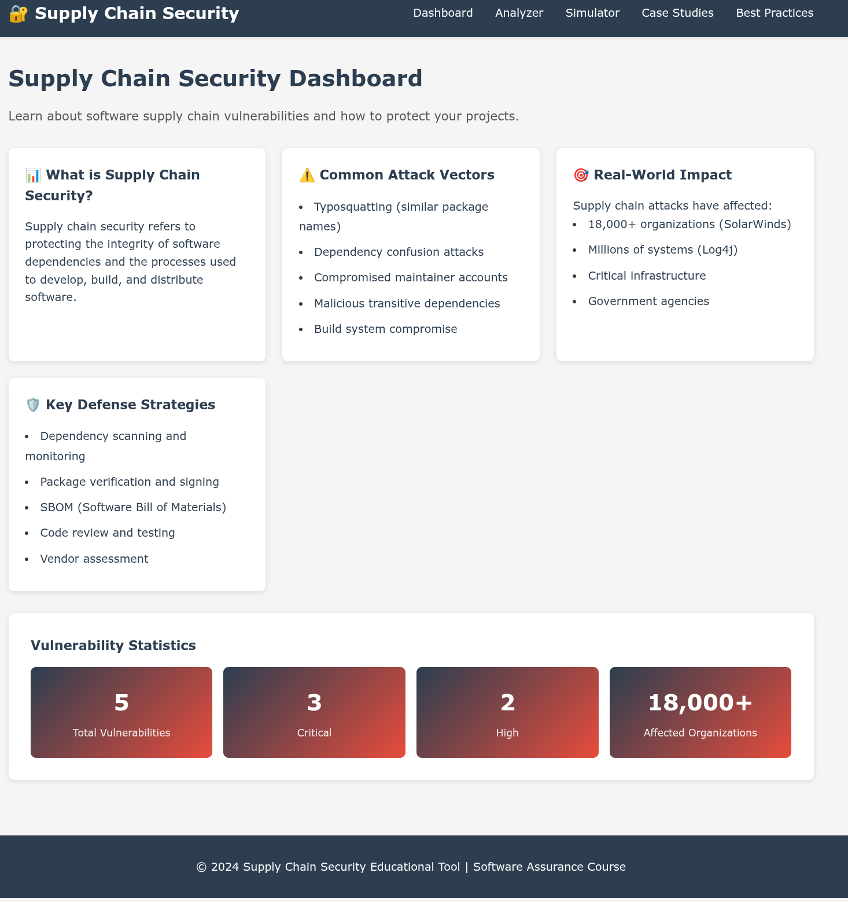
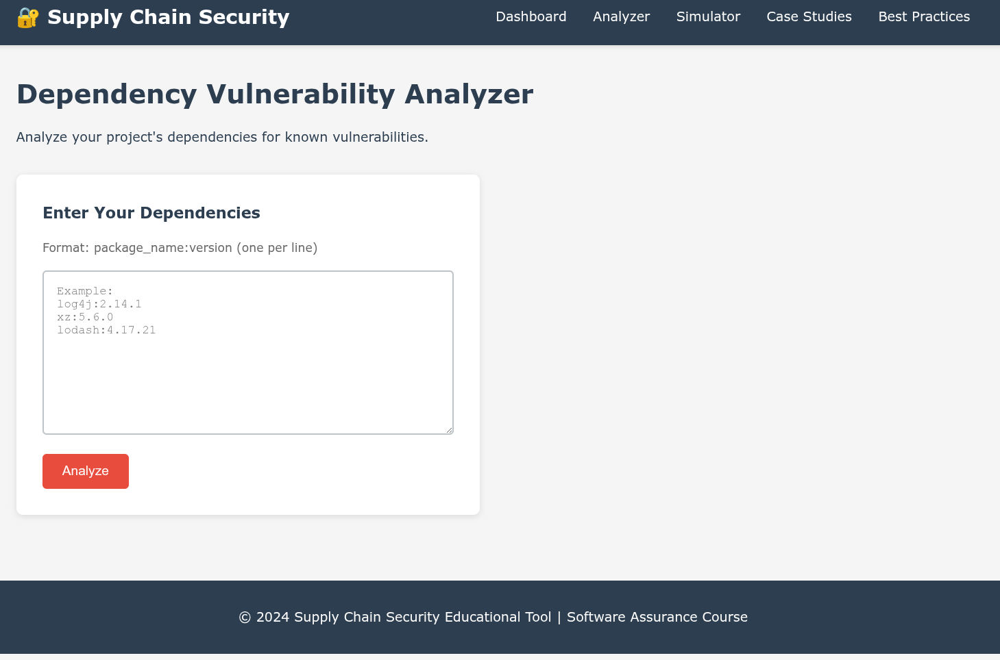
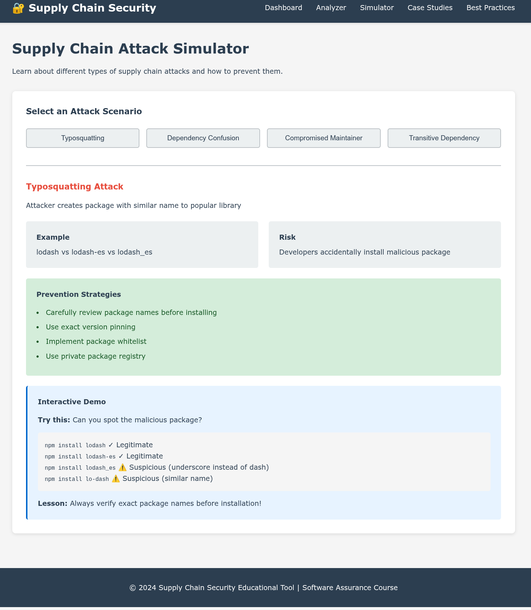
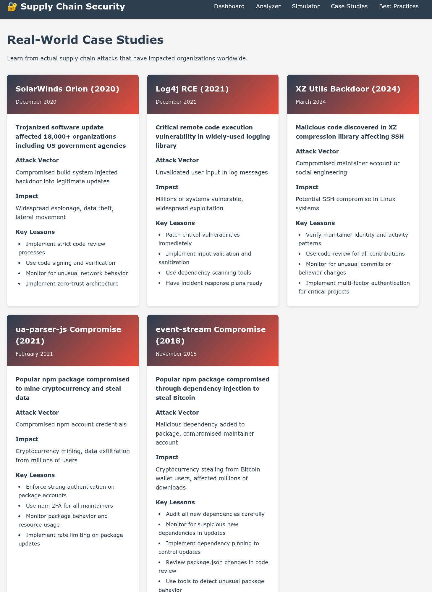
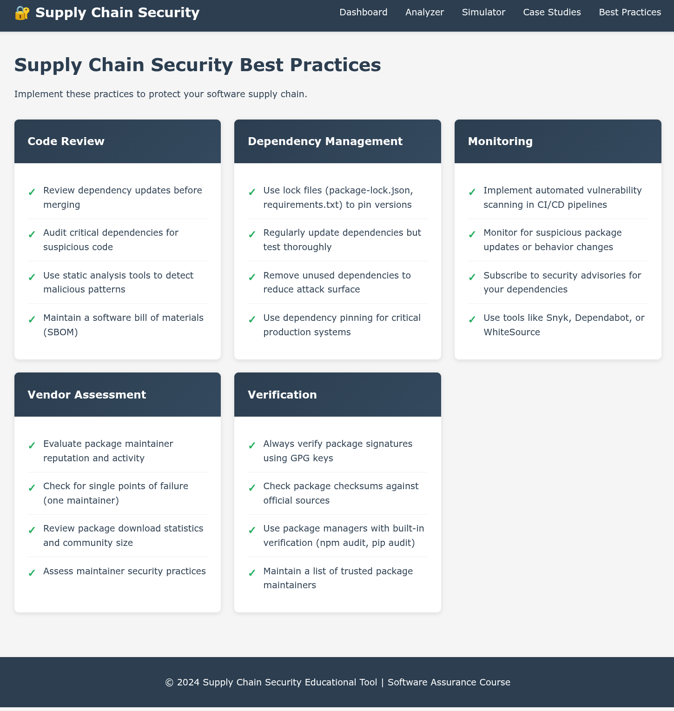

# Vibe coding assignment 1

## Overview

I used Aidermacs in Emacs (Claude Haiku 4-5).
I used it because it was setup from the last class I had.

## Description

The program I had Claude write is a simple client/server application.
There are 5 web pages in it:

1. Dashboard -

This gives a description of what this type of vulnerability is, common vectors of attack, the real world impact of vulnerabilities, and some key defence strategies.
It also has some statistics at the bottom of the current vulnerability counts that are affecting organizations.

2. Analyzer - 

A simple analyzer for different imports. I couldn't get this to work. The instruction say to paste dependencies in the text box, and then it is suppose to analyze them for known vulnerabilities.

3. Simulator - 

Gives simulations of multiple attack types:

  1. Typosquatting

  2. Dependency Confusion

  3. Compromised Maintainer

  4. Transitive Dependency

4. Case Studies

Shows some current real-world case studies, and what can be learned from them.

5. Best Practices - 

Some things to implement to protect a software supply chain.

## Vulnerability Description

Supply Chain Vulnerabilities is the injecting of malicious packages by replacing the package that is expected. This is done by changing the name, version, maintainer, or adding the malicious package as a dependency of a used package.

The two most notable are the Solarwinds and the log4j attack that happened recently (Which are described in the app, it also describes the other 3).

## Problems encountered

I only had minor problems encountered while creating the application:

Python is managed by my OS, so I had to make sure the AI knew it needed to use a venv for installation of packages.

The `Case Studies` page was missing one of the recent vulnerabilities, and I had to remind it to pull them all.
