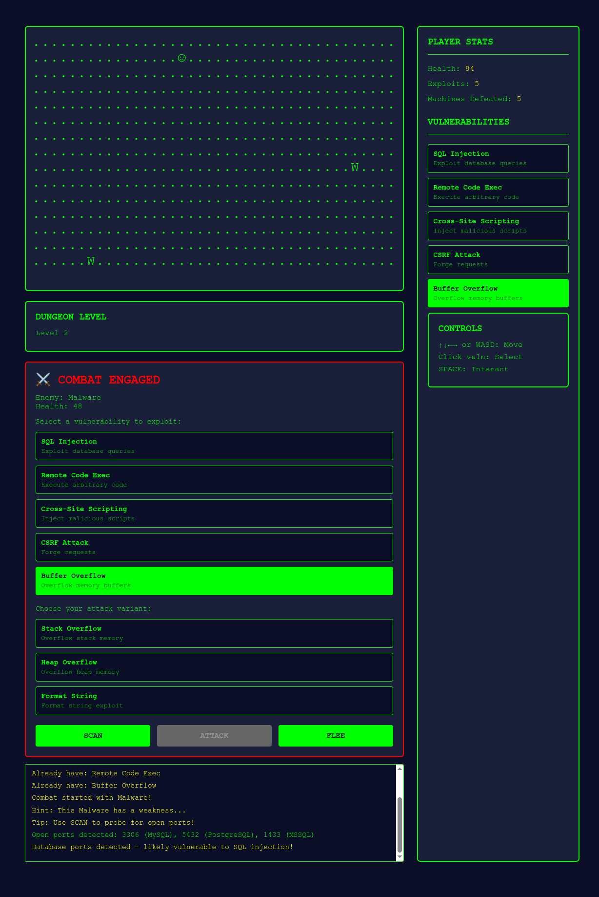

# Vibe coding assignment 2

## Overview

I used Aidermacs in Emacs (Claude Haiku 4-5).
I used it because it was setup from the last class I had.

## Description

I diverged from this assignment a little, but stayed within topic. Since we were learning about port scanning, I had Claude write me a simle roguelike where you attack bots with vulnerability attacks. You get to walk around, and pick up the attacks '?' and walk into the bots. There are Worms 'W', Servers 'S', Malware 'M', and Bots 'B'. Each has a vulnerability. While in battle, you have the option to 'Scan', 'Attack', or 'Flee'. Scan is a port scan, and will indicate the vulnerability the bot has. 'Attack' will attack the bot with the chosen vulnerability, and 'Flee' will try to run away from the bot.

## Vulnerability Description

This is more focused on the aspect of 'Port Scanning' and why it is useful in finding weaknesses in software. There are 4 vulnerabilities covered (and they are explained):

1. SQL Injection - Exploit Database Queries

	a. UNION-based - Uses `UNION SELECT`
	
	b. Blind SQL - Boolean based inference
	
	c. Time-Based - Delay-based detection

2. Remote Code Execution - Execute arbitrariy code

    a. Command Injection - Inject OS Commands
	
	b. Code Eval - Eval dangerous functions
	
	c. Deserialization - Unsafe Object deserialization

3. CSRF Attacks - Forge Requests

	a. Token Bypass - Bypass CSRF Tokens
	
	b. Cookie Theft - Steal session cookies
	
	c. Referer Spoof - Spoof HTTP referer

4. Buffer Overflow - Overflow memory buffers

	a. Stack Overflow - Overflow stack memory
	
	b. Heap Overflow - Overflow heap memory
	
	c. Format String - Format string exploit

5. Cross-Site Scripting - Inject malicious scripts

	a. Stored XSS - Persistent injection
	
	b. Reflected XSS - URL Parameter injection
	
	c. DOM-Based - Client-side manipulation

When a port scan is done, it lists off the open ports, it also lists off the related programs, and indicates what exploit will likely work on it.

## Problems encountered

I had no problems having Claude make this application. I explained my expectation, Claude created a prototype. I explained changes I wanted done to the prototype, and it did them.

## Conclusion

This could be expanded a lot. This initial prototype could be expanded into a full cyber security roguelike. One could even put parsers in there for the SQL injections, or a fake ssh shell for the remote code executions (although thoughs are normally done with bots that have been prescripted.)

