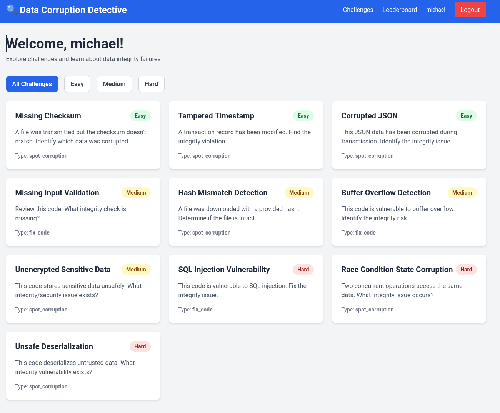
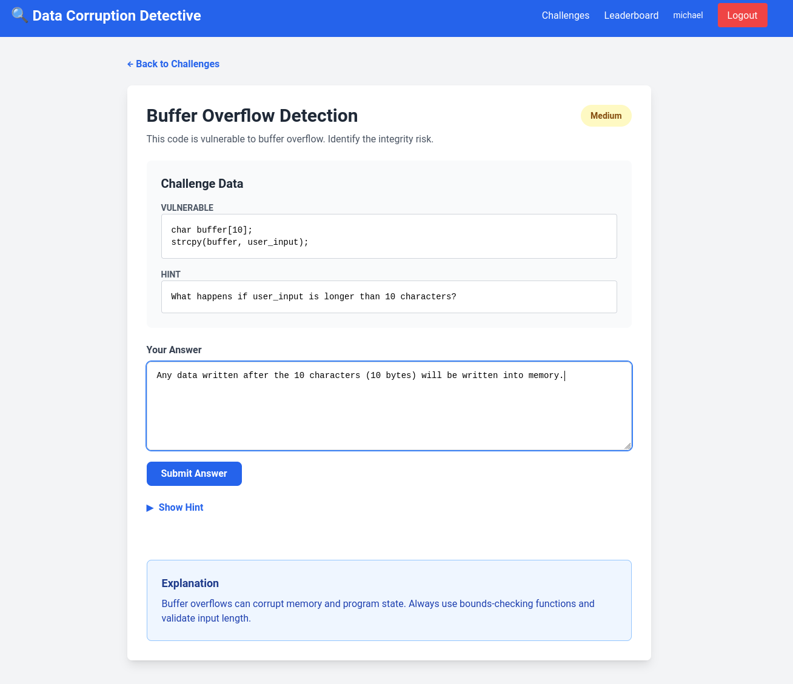
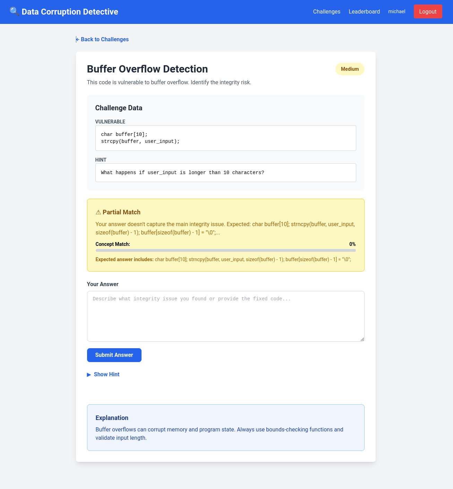
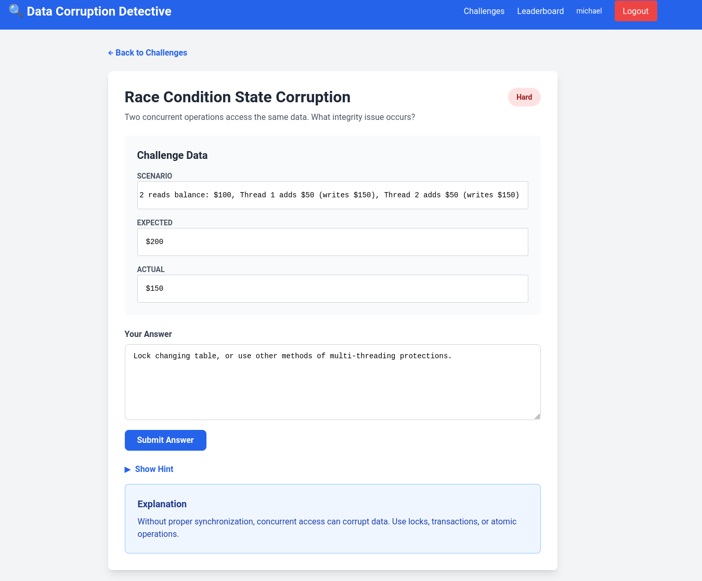
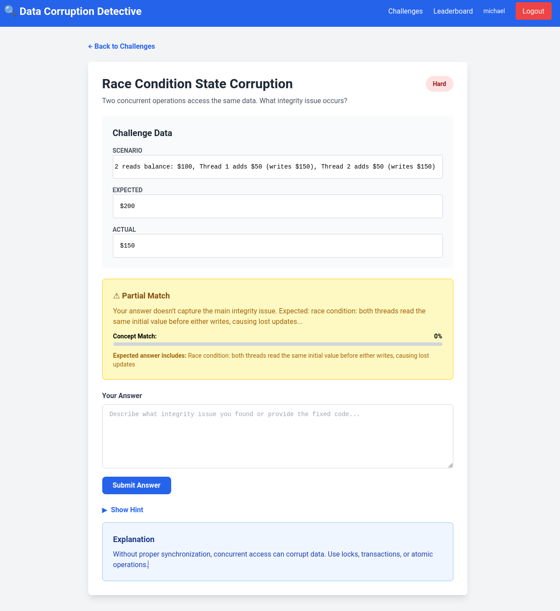
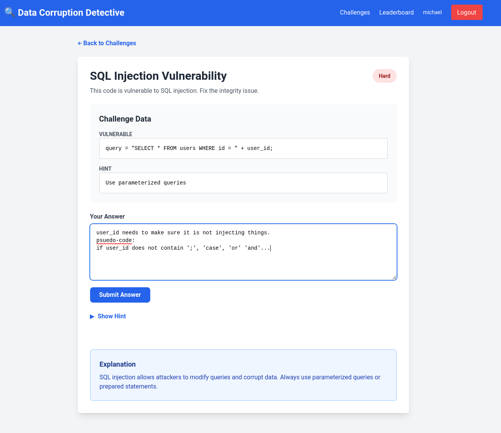
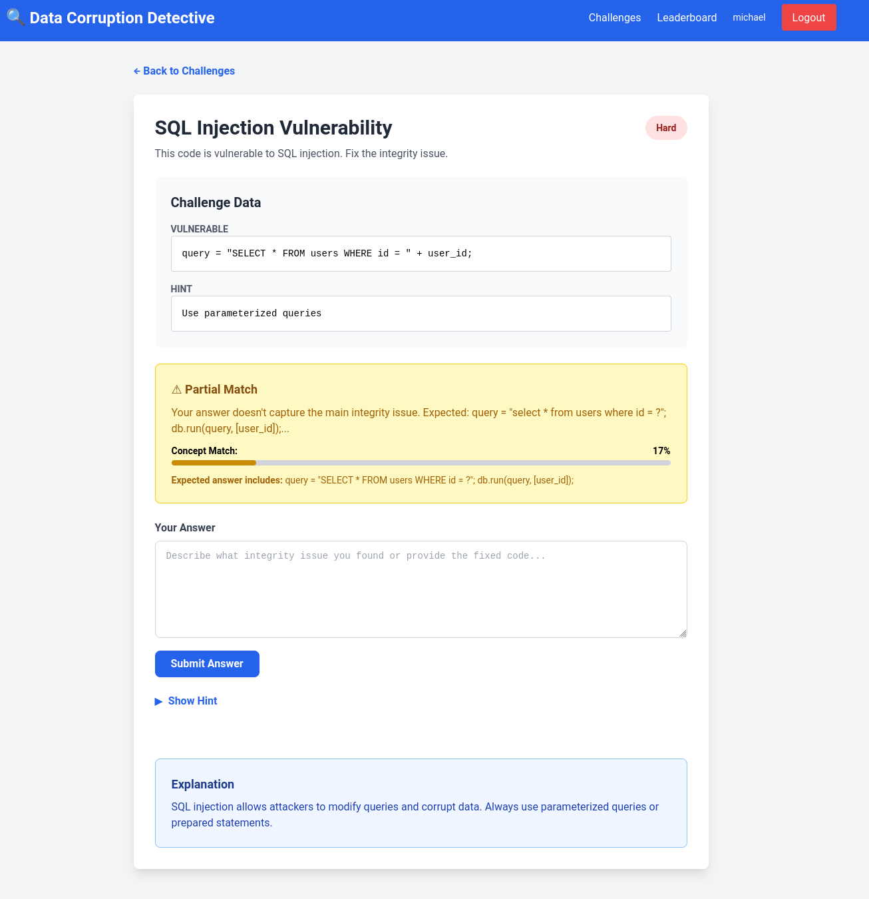

# Vibe coding assignment 2



## Overview

I used Aidermacs in Emacs (Claude Haiku 4-5).
I used it because it was setup from the last class I had.

## Description

This assignment, I worked with Claude to create a detective application to help teach people about Data Corruption.

## Vulnerability Description

Data Corruption is when some part of data that a user is receiving is somehow manipulated.

The most common manipulations are:

* SQL Injection - Where someone inject a manipulated sql statement into an input to manipulate a database underneath. The most famous example of this is Bobby Drop Tables from xkcd 

* Buffer overflow - Where one would submit data that would go beyond the memory limits of the variable. For instance, writing something to index 11 of a C string that only has 10 bytes allocated to it.:

``` C
int main() {
	int to_be_overflowed[10];
	
	to_be_overflowed[10] = 1;
	
	exit(0);
}
```

* Race conditions - Where multiple threads are writing to a unprotected data store, and the end value does not match up.

For example:

Initial Balance: $100.00

Thread 1 deposits $50.00 \
                          > Both transactions happen faster than the datastore can complete.
Thread 2 deposits $50.00 /

Ending balance: $150.00 (One transaction did not process correctly.)

## Problems encountered

This application was more of a nightmare to get Claude to program it. It wanted to be far too specific — as seen in the images — where one would answer a correct answer, but since they did not give a correct sql statement, or C statement, they would get the answer wrong.

### Buffer Overflow





### Race Conditions





## SQL Injections






## Conclusion

This vulnerability is one of the most dangerous. One can manipulate data in their favor, and steal data that they should not have access too. It is also one of the easier ones to avoid. Parametarizing the SQL functions, checking for buffer overflows in code, making transactions where multiple threads can be run thread safe (locking a table doesn't slow a system down if it is done right).
