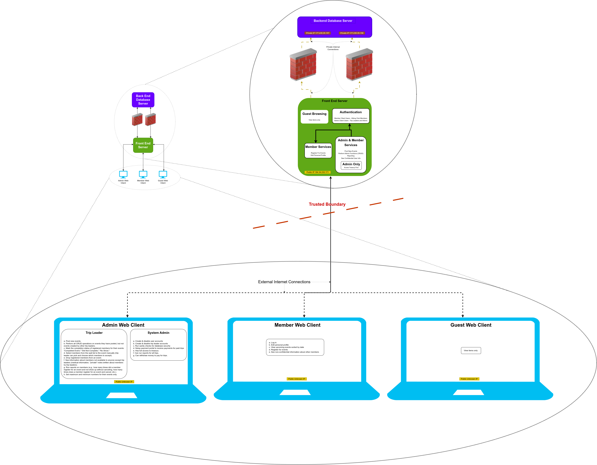

# Vulnerability Analysis - Threat Model
**MSSE 642 — Hands-On Assignment #2** 
**Authors:** Mike Olson & Clayton Conn  
**Date:** 2026-05-29

---

# Part 1: Secure Design Document

## 1. High-Level Project Description

The Hiking Club app connects Georgia Hiking Club members with trip leaders running hikes across Atlanta, the surrounding region, and destinations worldwide, welcoming members of all ages and fitness levels. Hikes are rated by difficulty so members can match their skill level to events before registering. The club is a non-profit, all-volunteer organization with no physical office; the web application is the core of the entire business, maintained by a single CTO. Member profiles store medical conditions and fitness notes that trip leaders use to screen registrations, making confidentiality a central requirement. The app also handles payment collection for annual membership dues and paid excursions, meaning financial data is a key asset to protect.

## 2. Organization Description

The Georgia Hiking Club (GHC) is a non-profit organization based in Alanta, Georgia. The mission of GHC is to connect residents and visitors with guided hiking experiences across the region and beyond. The club operates entirely through volunteers with no salaried positions and no physical office. Club officers manage day-to-do operations, including the CTO who is responsible for maintaining the web server and application. The club's is funded through business sponsors and annual membership fees paid by members. The web application is the business, all communication, registration, payment and record keeping flows through it. The reliability and security of the application directly determine the clubs ability to operate. 

## 3. Deployment Environment

The Georgia Hiking Club application is deployed on a cloud hosting platform (e.g., AWS or similar) managed by the CTO. The architecture separates public-facing and private components across two network tiers. The front-end web server sits in a public subnet and serves the member, admin, and guest web clients over HTTPS. The backend database server is isolated in a private subnet with no direct public internet access, accessible only from the web server via firewall rules. TLS certificates are provisioned on the web server to encrypt all data in transit. Payment processing is handled by a third-party PCI DSS-compliant payment processor; card data never touches the club's own servers. Automated backups of the database are scheduled nightly and retained for 2 years.

## 4. Secure Concepts Applicable to the Hiking Club Application

### 4.1 Authentication & Access Control

The GHC design document notes that complex passowrds are not enforces and that the site had been previously compromised through a brute-force attack. Authentication has become a high-priority security concern for this application. Without password complexity requiremnts or rate limiting an attacker is met with little resistance to no resistance.

A contributing factor to brute force vulnerability is weakness within the login page itself. In chapter 23, Hoffman explains that when applications return distinct error messages to incorrect login attempts, differences can confirm email addresses that match user accounts. The two variable guessing has now been diminshed into a one variable problem. A simple fix is generic login error messages, complex password requiremnts, and a rate limit for login attempts. 

### 4.2 Confidentiality & Data Protection

The hiking club app stores two main categories of sensitive user data, member medical conditions and fitness notes. System misconfiguration or a comprimised account both represnt a safety risk. 

Data protection is managed through user authorization and the rule of least privlige. Relating to the hiking club app, only admin users and trip leaders should have access to that specific data. Hoffman identifies that trust-by-default is a recurring anti-pattern when it comes to authorization. The fix to such an issue is that the server must derive the user's role upon every request. Role checks should never rely on data supplied by the client. Leas privlige applies to event rosters as well, team leaders should only be able to view medical information of members who are attending their event. 

### 4.3 Data Integrity & Tamper Detection

Payment data and event records must be protected from unauthorized modification and access. Payment specific data is left to a third party, so payment data never touches the hiking club servers. 

Data integrity vulnerabilities come into play when considering CSRF and SQL injection attacks. Both attacks can give bad actors the ability to modify and corrupt private hiking club data. 

### 4.4 Audit & Accountability

Audit logging gives GHC the ability to maintain a record of all actions within the application. Without it, actions taken within the system are unverifiable after the fact. This protects from the repudiation threat within the STRIDE model, the ability to take an action and credibly claim it never happend.

All admin actions should be logged with the admin users ID, a timestamp, and affected resource. 

### 4.5 Availability & Resilience

The brute-force attack documented in the design document is also a Denial of Service threat (DoS). Automated scripts consume server resources slowing or even crashing the system. With no fallback system, sustained unavailiabilty means a near halt in business. 

Rate limiting and account lockouts on the login endpoint are a primary defense. Cloud-based DDoS protection handles high volume attacks within the infrastructure, and session timeouts reduce token exposure. 
---

# Part 2: Hiking Club Threat Model Assessment

## Architectural Description of Software System

### System Components

- Front End Web Server
- Backend Database Server
- Admin Web Client (HTML)
- Member Web Client (HTML)
- Guest Web Client (HTML)

### Front End Web Server

#### Guest Browsing
- Functionality and user stories

#### Authentication
- Member and admin authentication mechanisms'xh

#### Authorization
- Permission controls by role

### Backend Database Server

[Database isolation and firewall requirements]

### Admin Client

#### Trip Leader Permissions
- a. Event creation and management
- b. CRUD operations on own events
- c. Member status tracking
- d. Waitlist management
- e. Member removal
- f. Confidential member information access
- g. Member reporting
- h. Event capacity settings

#### System Admin Permissions
- a. User account management
- b. Trip leader account management
- c. Database integrity checks
- d. Payment portal setup
- e. Treasury portal access

### Member Client

- Event viewing and registration
- Profile management
- Limited member information access

### Guest Client

- Public event listings
- No authentication required

---

## Deliverable Part 2A: Architecture Diagram

### Diagram Components

1. Systems and Components
   - a. Front End Web Server
   - b. Backend Database Server
   - c. Member Client
   - d. Admin Client
   - e. Firewall(s)
   - f. At least two networks
   - g. IP addresses (public and private)

2. Data Flow
   - Arrows showing communication between components

3. Trust Boundaries
   - Dashed lines depicting boundaries

---

## Deliverable Part 2B: STRIDE Threat Model (Shostack, 2014)

### Threat 1: Spoofing Identity

An attacker may attempt to impersonate a legitimate user, device, or service on the network by forging credentials, MAC addresses, or IP addresses. For example, ARP spoofing allows a malicious actor to link their MAC address with the IP address of a legitimate host, redirecting traffic meant for that host through the attacker's machine. Similarly, credential theft through phishing or brute-force attacks enables unauthorized users to authenticate as trusted accounts. Without strong mutual authentication mechanisms such as multi-factor authentication, certificate-based identity verification, or 802.1X port-level access control, networks remain highly vulnerable to identity spoofing attacks.
For the Hiking Club System, a spoof could happen to the front-end server if an attacker intercepted an admin's credentials by a fishing tactic, brute force tactics (password strength was never discussed), or other means. Alleviating this with more secure methods is suggested.

### Threat 2: Tampering with Data

Network communications and stored data are at risk of tampering when adequate integrity controls are absent. A man-in-the-middle (MITM) attacker positioned between two communicating hosts can intercept and modify packets in transit — altering financial transactions, injecting malicious payloads into software update streams, or corrupting configuration data sent to network devices. Without end-to-end encryption, digital signatures, and cryptographic message authentication codes (MACs), there is no reliable mechanism for recipients to detect whether transmitted data has been altered. Tampering threats also extend to network device configurations, where unauthorized modifications to router ACLs or firewall rules can silently expose critical systems.
System is most vulnerable with data tampering between the client system, and the front-end server. It is still possible for someone to get access to  the firewalls between the database server and the front-end server allowing them to access the data directly.

### Threat 3: Repudiation of Actions

Repudiation threats arise when a network lacks sufficient audit trails and non-repudiation controls, allowing users or systems to deny having performed actions they actually took. An attacker who compromises a logging server or tampers with event logs can erase evidence of intrusions, privilege escalations, or data exfiltration. Even legitimate insiders may deny unauthorized actions if logging is incomplete or unauthenticated. To counter repudiation threats, networks should employ centralized, tamper-evident logging solutions — such as write-once log stores or SIEM systems with cryptographic log signing — ensuring that all significant actions are attributable and traceable to a specific identity and time.
This design has a huge opportunity to get attacked by this. No logging was defined anywhere in the system.

### Threat 4: Information Disclosure

Sensitive data traversing a network can be exposed through eavesdropping, misconfigured access controls, or insecure protocols. Unencrypted protocols such as Telnet, FTP, or HTTP transmit credentials and data in plaintext, making them trivially capturable by anyone with access to the same network segment or an intermediate routing point. Misconfigured network shares, overly permissive firewall rules, and verbose error messages returned by services can all inadvertently reveal internal architecture, user data, or cryptographic material. Information disclosure threats are particularly dangerous in shared or multi-tenant environments where insufficient network segmentation allows traffic from one zone to be observed by hosts in another.
Considering the system will be running over https between the clients and the front-end server, this should not be an issues with them. Between the back-end and front-end servers it was never mentioned if they were secure, but most single-entry systems like the one proposed still use secure methods of communication such as over HTTPS.

### Threat 5: Denial of Service

Denial of Service (DoS) threats target the availability of network resources by overwhelming bandwidth, exhausting connection state tables, or exploiting protocol weaknesses. Common examples include SYN flood attacks, UDP amplification attacks, and resource exhaustion against application-layer services. Distributed variants (DDoS) leverage botnets to multiply attack volume far beyond what a single source could generate, making mitigation significantly more challenging. Critical infrastructure such as DNS resolvers, load balancers, and VPN concentrators are particularly attractive targets, as taking them offline can cascade into widespread service unavailability. Effective countermeasures include rate limiting, ingress and egress traffic filtering, anycast-based DDoS scrubbing services, and over-provisioning of critical network capacity to absorb volumetric attacks.
This system has no load balancers in place, so a Denial of Service is very possible in this system.

### Threat 6: Elevation of Privilege

Elevation of Privilege threats occur when an attacker gains capabilities or access rights beyond those they were explicitly granted, allowing them to operate outside their intended trust boundary. On a network, this may manifest as exploiting a vulnerability in a network management interface to escalate from a read-only monitoring account to full administrative control, or leveraging a misconfigured sudo rule on a network appliance to execute arbitrary commands as root. Attackers may also chain together lower-severity vulnerabilities — such as an information disclosure flaw combined with a weak credential policy — to progressively escalate their privileges across multiple systems. Defenses against elevation of privilege include strict enforcement of the principle of least privilege, regular audits of user and service account permissions, timely patching of network device firmware and management software, and network segmentation that limits lateral movement even after an initial compromise.
As the current Elevation of Privilege vulnerabilities in Linux systems have shown us, no one can be completely safe from this, but there are no obvious vulnerabilities for this system.

---
## Deliverable Part 2C: OWASP Threat Model

### 1. Assessment Scope — What's on the Line?

The hiking club web application is the only means for the GHC to serve hundreds of members across a wide range of ages and fitness levels. All business functions including: membership management, trip registration, payment collection, and confidential health records flow through this single application. The assets at risk and the business of their compromise define the scope of this threat model.

#### Critical Assets
- **Member medical conditions and fitness notes** — stored in member profiles, accessible to trip leaders and administrators; confidentiality is explicitly guaranteed by the club
- **Payment information** — membership dues and excursion fees processed through the payment portal; card data routed to a PCI DSS-compliant third-party processor
- **User account credentials** — email/password pairs for all three roles; compromise enables impersonation at any permission level
- **Event management data** — registrations, waitlists, no-show records, and fitness screening notes used to manage trip safety

#### Business Impact
- **Loss of member trust** — unauthorized access to medical conditions is a direct breach of the club's confidentiality commitment
- **Financial fraud** — payment record manipulation could result in members being charged incorrectly or excursion funds being misdirected
- **Physical safety risk** — altered or inaccessible medical notes could result in a leader being unaware of a participant's health condition during a remote hike
- **Operational shutdown** — application unavailability eliminates the club's entire operational capacity with no fallback system

### 2. Vulnerabilities — What Are They?

[Identification of specific weaknesses and potential attack vectors]

#### Authentication Vulnerabilities
- **No password complexity enforcement** — confirmed in the design document; enables low-effort brute-force attacks
- **Login enumeration** — distinct error messages for unknown username vs. incorrect password allow attackers to confirm valid member emails (Hoffman, YEAR, Ch. 23)
- **No rate limiting** — authentication endpoint accepts unlimited rapid requests, enabling automated credential attacks and resource exhaustion
- **No MFA for privileged roles** — trip leaders and administrators have no second factor protecting access to sensitive data

#### Authorization Vulnerabilities
- **Client-side role trust** — if role or permission values are accepted from client requests, members can escalate privileges without compromising credentials (Hoffman, YEAR, Ch. 25)
- **Overly broad trip leader data access** — trip leaders should access medical data only for their own events, not the full member roster

#### Data Protection Vulnerabilities
- **Missing HSTS** — without HTTP Strict Transport Security, browsers may connect over unencrypted HTTP, exposing session tokens and medical data in transit (Hoffman, YEAR, Ch. 22)
- **SQL injection risk** — unparameterized queries allow attacker-controlled input to manipulate database operations
- **CSRF exposure** — without `SameSite=Strict` cookie flag, forged cross-site requests can execute actions on behalf of authenticated users (Hoffman, YEAR, Ch. 22)

#### Infrastructure Vulnerabilities
- **No audit logging** — privileged actions and access to confidential data leave no tamper-evident record, enabling repudiation
- **Database isolation risk** — if the database is reachable from the public internet, SQL injection consequences escalate from data leakage to full data exfiltration
- **No rate limiting** - with brute force, or DDoS attacks and no rate limit restrictions bad actors can jam up and crash the server with hundreds of requests. 

### 3. Countermeasures — What Can You Do About It?

[Solutions and mitigation strategies for each vulnerability]

#### Authentication Controls
- Enforce strong password policies, with a minimum password complexity and scheduled mandatory password changes
- Return a single generic error message for all authentication failures: "Authentication failed. Username or password does not match."
- Implement rate limiting on the login endpoint with rules to lock accounts after a certain number of failed attempts.
- Require 2FA for all trip leader and administrator access.

#### Authorization Controls
- Implement role-based access control, following the principle of least privilege. Default to only give users the least amount of privilege then elevate.
- Enforce ownership boundaries for events, only allow trip leader to access medical data for members who are signed up for an upcoming/current event.

#### Data Protection Controls
- Set 'HttpOnly', 'Secure', and 'SameSite=Strict' flags on all session cookies.
- Enable HSTS with a minimum of one year 'max-age'
- Replace database queries with parameterized queries to prevent SQL injection

#### Infrastructure Controls
- Maintain database server in a private subnet with no public internet access
- Implement write-only audit logging for all administrative actions, payment events, and access to confidential member data
- Route all payment card data to a PCI DSS-compliant third-party processor; confirm card data never touches club servers
- Enable cloud-layer DDoS protection on public-facing endpoints. 

### 4. Prioritized Risks — List Them in Order

#### Priority 1 (Critical): Weak Authentication / Brute-Force Exposure
- **Threat:** Attackers can guess member credentials with no resistance.
- **Impact:** Full account takeover at any role level, including administrator; access to all sensitive data. *CONFIRMED PRIOR BREACH*
- **Likelihood:** High — the design document documents an actual compromise with no controls currently in place.
- **Remediation:** Enforce password complexity, implement rate limiting and account lockout. Deploy 2FA for privileged roles, harden session cookies with `HttpOnly` / `Secure` / `SameSite=Strict`. Replace distinct login errors with a single generic message

#### Priority 2 (High): Privilege Escalation via Client-Side Role Manipulation
- **Threat:** A regular member manipulates a role or permission field in the HTTP request to assume trip leader or administrator access
- **Impact:** Unauthorized access to member medical conditions, payment controls, and full administrative functions.
- **Likelihood:** Medium — requires knowledge of the API structure, but trivially exploitable once discovered and not detectable by the victim.
- **Remediation:** Derive role from server-side session on every request. Audit all endpoints for client-trusted permission fields; implement server-side ownership checks for event operations.

#### Priority 3 (Medium): Medical Data Disclosure via Information Leakage or Transport Exposure

- **Threat:** Missing HSTS allows HTTP connections that expose data in transit.
- **Impact:** Exposure of member health conditions, violating the club's confidentiality commitment and potentially endangering member safety
- **Likelihood:** Medium — HSTS can be a common oversight in a small application. 
- **Remediation:** Enforce HSTS, encrypt sensitive data at rest.

#### Priority 4 (Low): Repudiation of Administrative Actions
- **Threat:** No audit log exists for privileged actions. Administrators, trip leaders, or compromised accounts can take actions that cannot be attributed or disputed.
- **Impact:** No accountability for member bans, payment changes, or unauthorized medical data access. There is no evidence of admin actions.
- **Likelihood:** Low
- **Remediation:** Implement write-only audit logging for all privileged actions and confidential data access. Store logs separately from the application database.

---

## References

Hoffman, A. (YEAR). *Web application security* (2nd ed.). O'Reilly Media.

OWASP. (n.d.). *Category: Threat modeling*. Open Worldwide Application Security Project Wiki. https://wiki.owasp.org/index.php/Category:Threat_Modeling

OWASP. (n.d.). *Threat modeling*. Open Worldwide Application Security Project. https://owasp.org/www-community/Threat_Modeling

Shostack, A. (2014). *Threat modeling: designing for security*. Wiley
