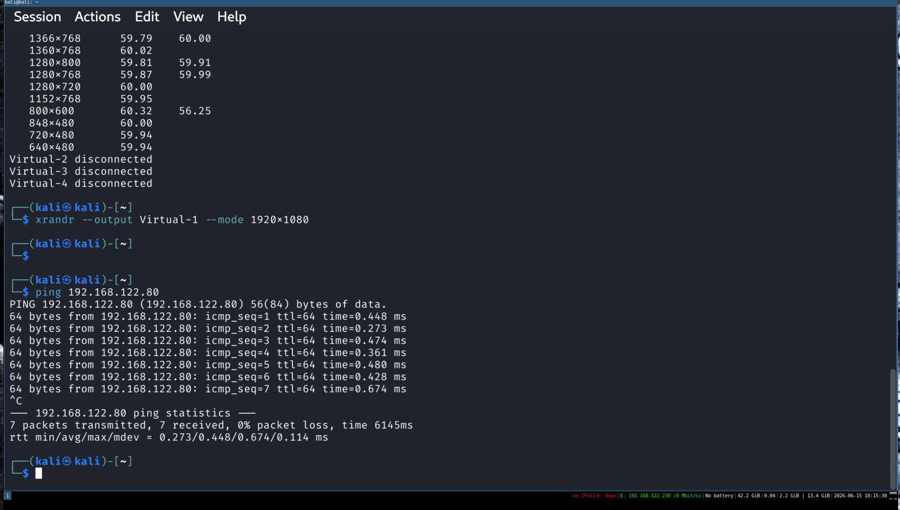
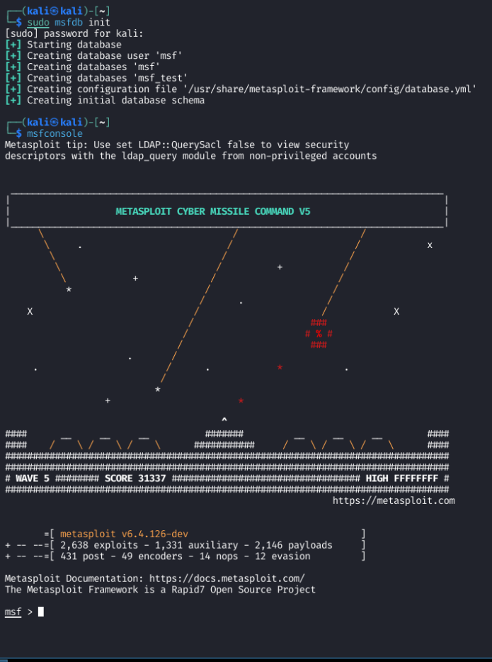
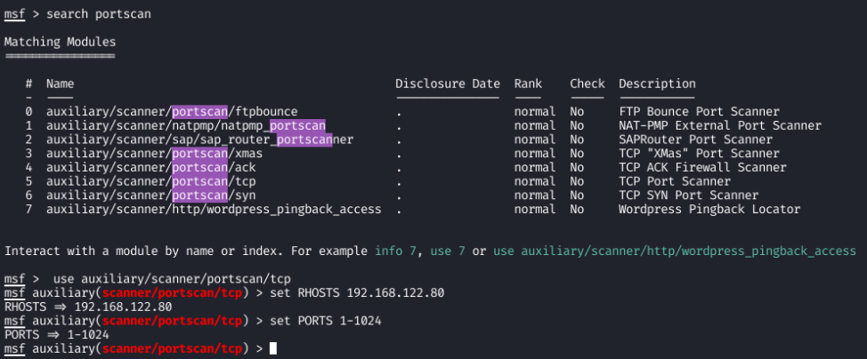
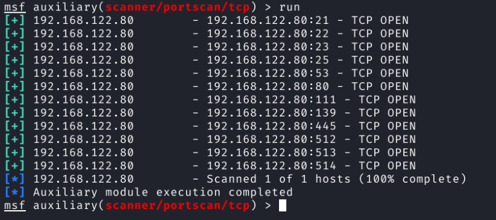
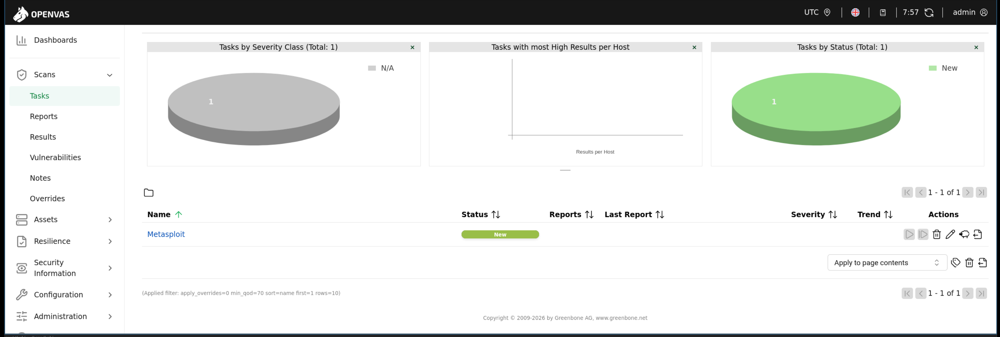

# Project 3
# Penetration Testing Lab 1
Mike Olson

# Part 1

Starting Metasploit Framework and Metasploitable 2

## Screenshot 1:

Shot of both OS's running, and Kali pinging Metasploitable 2



## Screenshot 2:

Metasploit Framework and console up and running



# Part 2

Use Metasploit Framework to perform a port scan on the target VM

## Screenshot 3 & 4:

Show port scanners and results of setup



## Screenshot 5:

Results of Port Scan



## Questions

1. What is the purpose of port scanning from the perspective of a Black Hat hacker?

The purpose of scanning for a black hat (invasive) hacker is to find a hole to pry into. SSH ports, web server ports, database ports are all possible ways to exploit a system, and since most services use well known ports, scanning what ports are open narrow down where the invasive hacker can find a foot hold or entry into the system. It also gives them a good layout of the OS and applications they are attacking. 

Operating systems (OSs) have a TCP/IP stack fingerprint that can narrow down or reveal the OS the system is running on.
Much software includes a banner when you log into them (Apache, ssh (depending on the configuration), &c.) these banners usually have the version names in them, and Common Vulnerabilities and Exposures (CVEs) for software is stored in databases so they can be looked up. The databases are there so people know what to fix, but no one will stop a hacker to look something up to see how to hack into it.

One can also find Network topology, firewall configurations, and a lot more from what ports are opened, closed, and filtered.

2. What is the purpose of port scanning from the perspective of an Ethical (White Hat) hacker?

The purpose of this for the white hat hacker is exactly the same, except for the opposite reasoning. Black hat hackers do it to break into the system. White hat hackers do it to find the vunerabilities so the black hat hackers have a more difficult time hacking in.

The ethical hacker uses thes tools to create a surface assessment to find every open port and service on systems that can be exploited, and report or correct them before they are. This also helps with vulnerability validation wher eone confirms that only services that are intended to be exposed are. A database port that should only be listening on localhost but is actually exposed to the network is a finding worth reporting even if it isn't exploited.

They also use it to verify the defenses of the system. They confirm if firewall rules, network segmentation, and hardening guides actually do what they are supposed to do.

Compliance is a huge keyword in most businesses, and ethical hackers have a huge part of that. Some industries require strict compliance, and many frameworks (PCI-DSS, NIST, ISO 27001) explicitly require periodic port scanning and service enumeration as part of their security program.

3. Why did we restrict the port to 1 - 1024?

To keep the noise down. These ports are where most of the interesting services use ports (except mysql/mariadb), and are more well-known to be used by services than the ports above 1024 are.

# Part 3

## Introduction

I am doing my lab on Tenable's Nessus. Nessus is a vulnerability tool (originally opensource, but not proprietary) to scan for vulnerabilities specifically for software flaws, missing patches, malware and misconfiguration errors. The product offers these for a wide range of operating systems, devices, and applications.

## Big Picture

This product would fit into the scanning penetration test process.

## Lab

This tool is proprietary, and does not come with Kali. I am not able to use the tool itself in penetration testing because I could not afford to use it. There is an open source platform based on when the framework was open source (greenbone Community Edition) which I was able to use in the Kali Linux machine. It can be installed (from the kali repositories.)

``` shell
sudo apt update
sudp apt install gvm

# This part takes a while.
sudo gvm-setup

sudo gvm-start
```

This tool is amazingly slow the first time it is installed. Almost best to install it, load up the web-ui, and go play a few games of monopoly with a few friends.

Waiting for OpenVAS 



## Conclusion

The tool I used was very powerful, and I am assuming the proprietary tool is also powerful (and hopefully a lot faster). Whenever it finishes, I'll update this readme to show how well it worked.

## References

tenable Nessus https://www.tenable.com/products/nessus

Installing Greenbone Community Edition on Kali https://greenbone.github.io/docs/latest/22.4/kali/index.html
