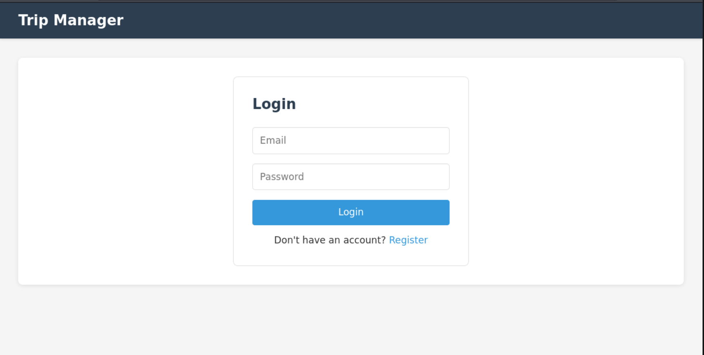
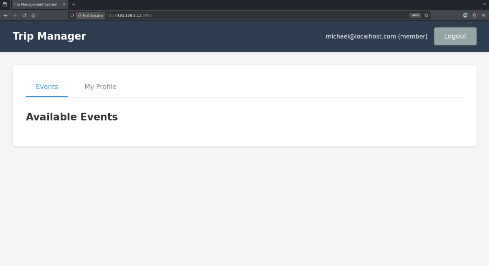
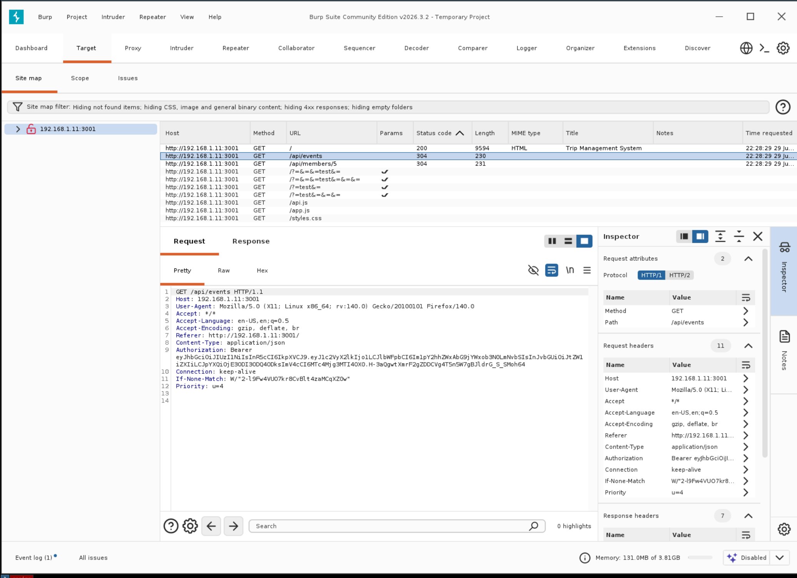

# Penetration Testing Lab 2

Mike Olson

MSSE642-Software Assurance

06-25-2026

## Part 1: Testing Procedure

### Summary Table

| Phase                 | Description                                                                                                                                                                                                                                                                                                                                                                                                      | Tool                 |
|-----------------------|------------------------------------------------------------------------------------------------------------------------------------------------------------------------------------------------------------------------------------------------------------------------------------------------------------------------------------------------------------------------------------------------------------------|----------------------|
| Information Gathering | This is the first phase of the penetration testing. In this phase, one passively and actively collects data about the site.  The information that is gathered includes website and webserver information, applications used for the website, directory structures, operating systems, endpoints, etc. The goal in this phase is to gather as much information as possible without attempting to expoit anything. | DMitry / DirBuster |
| Gaining Access        | This phase gains access to the application using the information gathered in the previous phase. It will actively probe for vulnerabilities that are exploitable. Using sql injection and cross-site scripting one can attempt to bypass authentication, obtain sensitive information, and manipulate data on the server.                                                                                        | OWASP Zap            |

### Tool Descriptions and Analysis

#### DMitry: [Deep Magic Information Gathering Tool](https://github.com/jaygreig86/dmitry)

DMitry (Deepmagic Information Gathering Tool) is a command-line reconnaissance utility for Linux that performs passive and active information gathering against a target host or domain. It can enumerate subdomains, retrieve Whois records, gather email addresses, perform TCP port scans, and pull information from services like Netcraft — all in a single run. It's commonly used in the early reconnaissance phase of a penetration test to build a target profile before moving on to active exploitation.

It is included by default in Kali Linux distributions, and is available in most linux distribution repositories.

To use DMitry against a web application, you would typically start by running it against the target domain with a combined set of flags — for example, dmitry -winsepo output.txt target.com — which will perform Whois lookups, retrieve IP information, search for subdomains, scrape email addresses from the site, and run a basic TCP port scan against common ports. The subdomain enumeration helps you discover hidden or forgotten parts of the application (admin panels, staging environments, API endpoints) that may not be publicly advertised but could be vulnerable. The port scan reveals which services are exposed on the server, giving you a map of potential attack surfaces such as open database ports, FTP, or unintended SSH access. The email harvesting output can be useful for understanding the organization's structure and potentially feeding into social engineering or phishing simulations as part of a broader authorized engagement.

#### Dirbuster: [DirBuster](https://www.kali.org/tools/dirbuster)

DirBuster is a multi-threaded Java-based brute-force tool that discovers hidden directories and files on a web server by systematically attempting a large wordlist of common path names against the target URL. It reveals content that isn't linked or publicly advertised — such as admin panels, backup files, configuration files, and forgotten upload directories — by sending HTTP requests and analyzing the server's responses. It comes bundled with OWASP and Kali Linux and can operate in both GUI and headless modes, making it flexible for different testing environments.

It is included by default on Kali Linux

To use DirBuster against a web application, you would launch it (or its command-line successor dirb, or the more modern gobuster) and point it at the target URL with a chosen wordlist — for example, using one of the bundled lists like directory-list-2.3-medium.txt — and it will systematically request every path in that list, flagging any that return a 200, 301, 403, or other meaningful HTTP response code. Hits on 403 (Forbidden) responses are particularly interesting because they confirm a directory exists even though access is denied, which may be exploitable through misconfigured permissions or parameter tampering. Discovered paths like /admin, /backup, /config, or /uploads become direct targets for deeper manual investigation or further automated scanning with tools like Nikto or Burp Suite. Because DirBuster generates a high volume of requests in a short time, it should only ever be run against applications you have explicit written authorization to test, as it will be clearly visible in server logs and can impact performance.

#### Burp Suite: [Burp Suite](https://portswigger.net/burp/communitydownload)

Burp Suite is an integrated web application security testing platform developed by PortSwigger that acts as an intercepting proxy between your browser and the target web application, allowing you to capture, inspect, modify, and replay every HTTP/HTTPS request and response in real time. It bundles a comprehensive set of tools including a Spider for crawling application content, a Scanner for automated vulnerability detection (in the Pro version), an Intruder for automated fuzzing and brute-force attacks, a Repeater for manually tweaking and resending individual requests, and a Decoder/Comparer for analyzing encoded or obfuscated data. It is widely considered the industry-standard tool for web application penetration testing and is available in a free Community edition and a paid Professional edition with full scanning capabilities.

It is included by default on Kali Linux

To use Burp Suite against a web application, you configure your browser to route traffic through Burp's local proxy (typically 127.0.0.1:8080) and install its CA certificate so it can intercept HTTPS traffic without triggering browser warnings. From there you browse the application normally, letting Burp's Spider and passive scanner map out the attack surface — all discovered endpoints, parameters, cookies, and headers appear in the Target tab's site map. You then use the Repeater to manually probe interesting requests, tweaking parameters to test for injection flaws, authentication bypasses, or access control issues, and use Intruder to automate attacks like credential stuffing, parameter fuzzing, or session token analysis. Findings from DMitry and DirBuster feed naturally into Burp — discovered subdomains and hidden directories become targets you add to Burp's scope, and from there you can chain the tools into a coherent reconnaissance-to-exploitation workflow within a single authorized engagement.

### References

Singh, G. (2019). *Learn Kali Linux 2019: Perform powerful penetration testing using Kali Linux, Metasploit, Nessus, Nmap, and Wireshark.* Packt Publishing.

DMitry. (n.d.). Deepmagic Information Gathering Tool. https://www.kali.org/tools/dmitry/ **Note:** The homepage for the project is not available.

OWASP Foundation. (n.d.). DirBuster. https://www.kali.org/tools/dirbuster/

PortSwigger. (n.d.). *Burp Suite*. https://portswigger.net/

## Part 2: Hiking Club Application

### Overview

Created using Aidermacs in Emacs (claude-haiku-4-5). Architecture is a 3-tier web application (Database -> Web Server -> Frontend UI). Each are talking to each other with REST endpoints. The database has a strict firewall on it, only allowing communication from one IP address (the Web Server.)

### Screenshots





### Deployment

The Hiking application was deployed in a docker container on a brand new VM. (Kinda simulates an AWS lightsail deployment with a docker image.)

### Penetration Testing Results

#### Dmitry

``` bash
$ dmitry -p 192.168.1.11
Deepmagic Information Gathering Tool
"There be some deep magic going on"

ERROR: Unable to locate Host Name for 192.168.1.11
Continuing with limited modules
HostIP:192.168.1.11
HostName:

Gathered TCP Port information for 192.168.1.11
---------------------------------

 Port		State

25/tcp		open

Portscan Finished: Scanned 150 ports, 148 ports were in state closed


All scans completed, exiting
```

### DirBuster

``` bash
$ dirb http://192.168.1.11:3001 /usr/share/wordlists/dirb/common.txt -o dirb_results.txt

-----------------
DIRB v2.22
By The Dark Raver
-----------------

OUTPUT_FILE: dirb_results.txt
START_TIME: Mon Jun 29 21:54:41 2026
URL_BASE: http://192.168.1.11:3001/
WORDLIST_FILES: /usr/share/wordlists/dirb/common.txt

-----------------

GENERATED WORDS: 4612

---- Scanning URL: http://192.168.1.11:3001/ ----
==> DIRECTORY: http://192.168.1.11:3001/api/

---- Entering directory: http://192.168.1.11:3001/api/ ----
+ http://192.168.1.11:3001/api/admin (CODE:401|SIZE:29)
+ http://192.168.1.11:3001/api/Admin (CODE:401|SIZE:29)
+ http://192.168.1.11:3001/api/ADMIN (CODE:401|SIZE:29)
+ http://192.168.1.11:3001/api/events (CODE:401|SIZE:29)
+ http://192.168.1.11:3001/api/Events (CODE:401|SIZE:29)
+ http://192.168.1.11:3001/api/members (CODE:401|SIZE:29)
+ http://192.168.1.11:3001/api/Members (CODE:401|SIZE:29)
```
-----------------
END_TIME: Mon Jun 29 21:54:44 2026
DOWNLOADED: 9224 - FOUND: 7
```

### BurpSuite




### Claude Pen testing

Interaestingly enough, when I told it what I was doing, it wrote a script for penetration testing as well:

``` bash
==========================================
Penetration Testing - Trip Management System
==========================================

[TEST 1] Weak Password Validation
Attempting to register with password '1'...
[SAFE] Password validation working

[TEST 2] SQL Injection in Login
Attempting SQL injection in email field...
[SAFE] SQL injection blocked

[TEST 3] Missing Authentication on Protected Endpoints
Attempting to access /api/admin/users without token...
[SAFE] Endpoint requires authentication

[TEST 4] Horizontal Privilege Escalation
Logging in as member...
Attempting to access other member's profile...
[VULNERABLE] Can access other members' confidential info

[TEST 5] Brute Force Protection
Attempting 10 failed logins...
Checking if account is locked...
[VULNERABLE] No brute force protection

[TEST 6] CORS Misconfiguration
Testing CORS from unauthorized origin...
[SAFE] CORS properly configured

[TEST 7] Information Disclosure in Error Messages
Triggering error with invalid event ID...
[SAFE] Error messages are generic

==========================================
Penetration Testing Complete
==========================================

``` 
